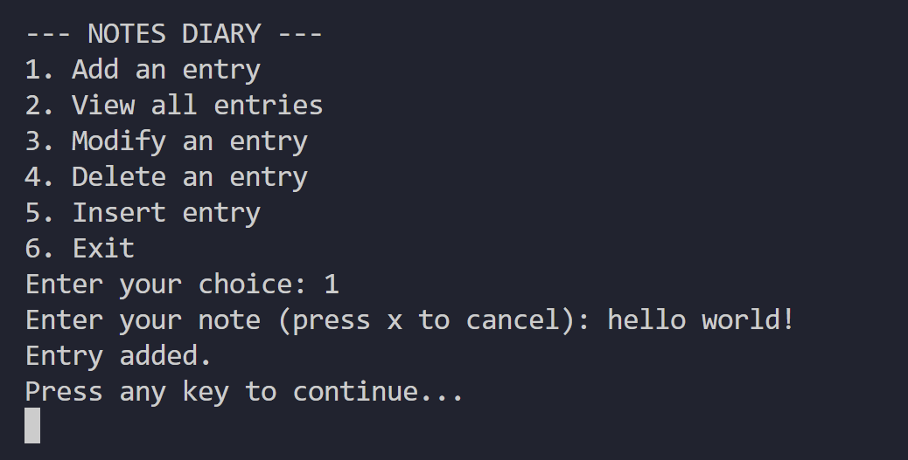
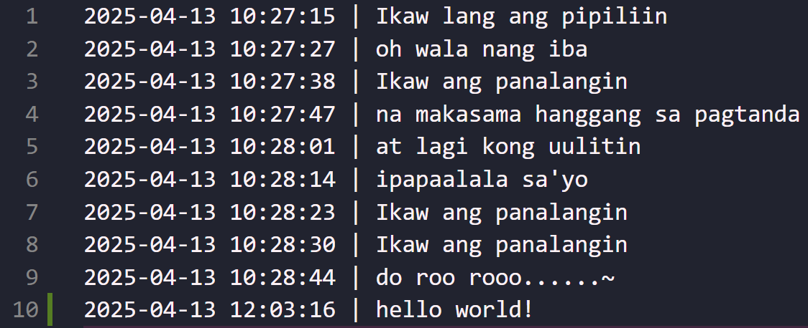

# 📝 C# Notes Diary
by: ***marieemoiselle***
<br/>

## ✨ What it is
A C# console-based application that lets you **add**, **view**, **insert**, **delete** your diary entries stored in a local text file.

## 📦 Features
✅ Adds a new entry with included timestamp. <br/>
✅ View your diary entries <br/>
✅ Modify an existing diary entry <br/>
✅ Delete an existing diary entry <br/>
✅ Insert an entry in between existing entries <br/>
💾 ***notes.txt*** serves as the storage of the diary entries.

## 💡 Getting Started
📌 .NET SDK (Core or Framework) <br/>
📌 A terminal or command prompt

## 🏃🏻‍♀️ How to Run
Use the following command to run the program:
```
\directory\NotesDiary> dotnet build
\directory\NotesDiary> dotnet run
``` 
<small>💡 Make sure that ```Program.cs``` is in a valid .NET Console Project.</small>

## 🖥️ Sample Output


